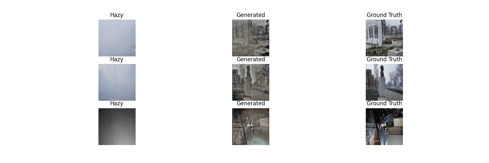

# HazeHeal: Advanced Image Dehazing Model


HazeHeal is a state-of-the-art GAN-based image dehazing model implemented in TensorFlow 2.x. It effectively removes haze from images while preserving the original image details and colors.

## Architecture Overview

The model consists of two main networks:

### Generator

The generator network features:
- Instance Normalization layers for better style handling
- Residual blocks for preserving image details
- Mish activation function for improved performance
- Encoder-decoder architecture with skip connections
- Spectral normalization for training stability

### Discriminator

The discriminator network includes:
- Convolutional layers with spectral normalization
- LeakyReLU activation
- No batch normalization for improved training stability
- PatchGAN architecture for realistic texture generation

## Features

- **Advanced Normalization**: Uses Instance Normalization and Spectral Normalization
- **Custom Activation**: Implements Mish activation function
- **Efficient Training**: Implements gradient clipping and adaptive learning rates
- **Robust Loss Functions**: Combines adversarial and pixel-wise losses
- **Data Augmentation**: Includes comprehensive image preprocessing
- **Progress Monitoring**: Generates sample outputs during training
- **Checkpointing**: Automatic model saving and restoration

## Requirements

```
tensorflow >= 2.0
numpy
matplotlib
pillow
glob
logging
```

## Project Structure

```
HazeHeal/
├── checkpoints/         
├── samples/             
├── generator_model.png  
├── discriminator_model.png 
├── HazeHeal.ipynb             
└── README.md           
```

## Usage

### Data Preparation

Place your training data in the following structure:
```
dataset/
├── hazy/              # Hazy images
└── GT/                # Ground truth clear images
```

### Training

```python
# Configure training parameters
HAZY_DIR = '/path/to/hazy/images'
GT_DIR = '/path/to/ground/truth/images'
IMAGE_SIZE = (256, 256)
BATCH_SIZE = 4
NUM_EPOCHS = 5000


```

### Model Components

1. **DehazeGAN**: Main model class implementing the GAN architecture
   - Custom generator with residual blocks
   - PatchGAN discriminator
   - Advanced loss functions

2. **DehazeDataProcessor**: Handles data loading and preprocessing
   - Image resizing and normalization
   - Dataset creation and batching
   - Data augmentation

3. **DehazeTrainer**: Manages the training process
   - Checkpoint handling
   - Progress visualization
   - Sample generation

## Training Process

The model training includes:
- Adaptive learning rate scheduling
- Regular checkpoint saving
- Sample image generation every 10 epochs
- Progress logging with loss metrics
- Real-time visualization of dehazing results

## Results Visualization

Sample results showing hazy input, dehazed output, and ground truth:



## Model Performance

The model achieves optimal dehazing results after approximately 2500 epochs, with:
- Generator Loss: 2.7550
- Discriminator Loss: 0.893


# Results
Image after completion 10 epoch:


Image after completion of 5000 epoch:


